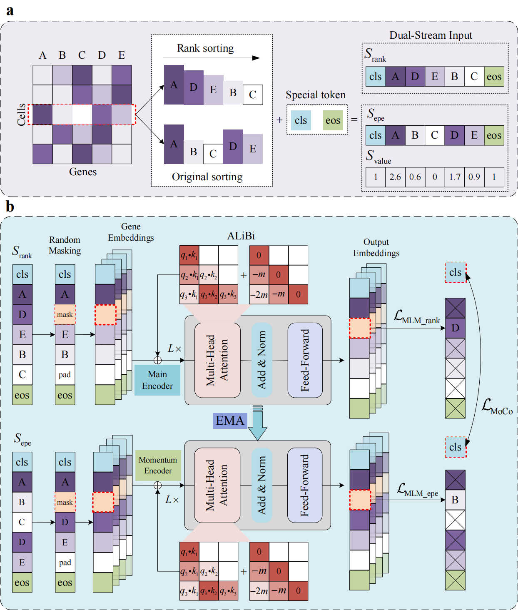

---

# scDMC: Synergistic Pre-training of Single-Cell Language Models with Dual-Stream MLM and Contrastive Learning

[](https://www.python.org/downloads/release/python-3120/)
[](https://pytorch.org/)
[](https://scanpy.readthedocs.io/en/stable/)
[](https://github.com/huggingface/transformers)
[](https://arxiv.org/abs/YOUR_ARXIV_ID) <!-- 请替换为您的论文链接 -->

---

## Overview

Deep learning foundation models are revolutionizing single-cell biology. However, learning holistic and discriminative representations from complex, high-dimensional data remains a central challenge. Existing models often use single-input encoding schemes (e.g., gene ranking or expression binning), which can lead to the loss of critical biological information.

To address this, we introduce **scDMC**, an innovative pre-training framework that synergistically optimizes information fidelity at both the gene and cell levels. As detailed in our paper, scDMC's design is based on two core principles:

1.  **Dual-Stream Input**: For the first time, we process two complementary representations of each cell in parallel:
    *   A **rank-based stream** to capture the relative importance and functional context of genes.
    *   An **expression-aware stream** to preserve the absolute magnitude of gene expression.
2.  **Synergistic Pre-training**: We combine two self-supervised tasks:
    *   **Dual-Stream Masked Language Modeling (MLM)** to learn contextual gene co-expression patterns.
    *   **Cell Momentum Contrastive Learning (MoCo)** to learn a discriminative embedding space for global cell states.

This dual-stream, dual-task design allows scDMC to build a more comprehensive and robust understanding of cellular identity.

<details>
<summary><b>Click to see the scDMC Model Architecture</b></summary>
<div align="center">
  
  <br>
  <em><b>Fig 1.</b> The scDMC model architecture, featuring dual-stream input construction and a pre-training process combining Dual-Stream MLM with Cell Momentum Contrastive Learning.</em>
</div>
</details>

---

## Key Features & Highlights

As demonstrated in our study, scDMC exhibits several key advantages:

-   **🚀 State-of-the-Art Performance**: Achieves superior results across multiple challenging benchmarks.
-   **⚙️ High Data Efficiency**: Reaches top performance by pre-training on only 2 million cells, significantly fewer than many contemporary models. 
-   **🧩 Robust Batch Correction**: Effectively integrates datasets from diverse donors and technology platforms, preserving biological identity while removing technical noise.
-   **🔬 Deep Biological Interpretability**: The learned embeddings not only classify cells accurately but also uncover functional gene modules and infer cell-type-specific regulatory networks in a data-driven manner.

---

## Installation

We strongly recommend creating a dedicated `conda` environment from the provided file to ensure all dependencies are correctly managed.

**1. Clone the repository:**
```bash
git clone https://github.com/HonglieGuo/scDMC.git
cd scDMC
```

**2. Create and activate the conda environment:**
This command installs all required packages, including PyTorch, Scanpy, and their specific versions.
```bash
conda env create -f environment.yml
conda activate scdmc
```

**Alternative (`pip`):**
You can also install packages using `pip`. Note that this is less reliable for complex dependencies like PyTorch with CUDA.
```bash
pip install -r requirements.txt
```
> **⚠️ Warning**: The `torch` version in `requirements.txt` is compiled with a specific CUDA version (`cu128`). If your system configuration differs, please see the [official PyTorch website](https://pytorch.org/get-started/locally/) for the correct installation command.

---

## Workflow and Quick Start

The complete workflow involves data preparation, tokenization, pre-training, and application to downstream tasks.

### 1. Data Availability

All datasets used in our study are publicly available.

| Dataset      | Used For               | Source / Download Link                                                                                                                                                 |
| :----------- | :--------------------- | :--------------------------------------------------------------------------------------------------------------------------------------------------------------------- |
| **CELLxGENE**  | Pre-training         | [CELLxGENE Census (Release 2024-07-01)](https://cellxgene.cziscience.com/)                                                                                              |
| **Zheng68K** | Downstream Tasks       | [10x Genomics Datasets](https://www.10xgenomics.com/cn/datasets/fresh-68-k-pbm-cs-donor-a-1-standard-1-1-0)                                                                     |
| **PBMC10K**  | Downstream Tasks       | Retrieved via `scvi-tools` API: `scvi.data.pbmc_dataset()`                                                                                                               |
| **BMMC**     | Downstream Tasks       | [GEO: GSE194122](https://www.ncbi.nlm.nih.gov/geo/query/acc.cgi?acc=GSE194122)                                                                                            |
| **Immune**   | Downstream Tasks       | [Figshare Repository](https://figshare.com/articles/dataset/Benchmarking_atlas-level_data_integration_in_single-cell_genomics_-_integration_task_datasets_Immune_and_pancreas_/12420968/8) |
| **MS**       | Downstream Tasks       | [Single Cell Expression Atlas: E-HCAD-35](https://www.ebi.ac.uk/gxa/sc/experiments/E-HCAD-35/downloads)                                                                      |
| **Myeloid**  | Downstream Tasks       | [GEO: GSE154763](https://www.ncbi.nlm.nih.gov/geo/query/acc.cgi?acc=GSE154763)                                                                                            |

### 2. Data Preparation and Tokenization

Our framework treats genes as "tokens". We provide a vocabulary of 60,534 common tokens, including 60,530 unique genes (mapped by Ensembl IDs) and four special tokens: `[PAD]`, `[MASK]`, `[CLS]`, and `[EOS]`. You can find the vocabulary file here: [`tokenizer/token_files/token_ids_60534.json`](./tokenizer/token_files/token_ids_60534.json).
The tokenization script processes raw count data (`.h5ad` format) to generate the dual-stream inputs required for the model.

```bash
cd tokenizer

# Example command to tokenize your data
python -u tokenizer_combine.py \
    --input_directory path/to/your/h5ad_files/  `# Directory with AnnData files` \
    --output_directory ./tokenized_data/         `# Directory to save tokenized parquet file` \
    --output_prefix your_dataset                   `# Prefix for output files`
```

### 3. Pre-training

Run the pre-training script to train the scDMC model from scratch using the dual-stream MLM and contrastive learning objectives.

```bash
cd pretrain

# Example pre-training command
python -u scDMC_pretrain.py \
    --dataset_path path/to/tokenized_data.parquet \
    --output_dir ./scDMC_pretrained_model \
    --batch_size 24 \
    --learning_rate 5e-5
```
> 👉 **Note**: For optimal performance and efficiency, our implementation leverages **FlashAttention** and **ALiBi** (Attention with Linear Biases), making it well-suited for the long sequences typical of single-cell data.

### 4. Fine-tuning and Downstream Applications

Apply the pre-trained model to various tasks like cell type annotation, clustering, or data integration.

```bash
cd downstream_tasks

# Example: Fine-tuning for cell type annotation
python -u downstream_tasks.py \
    --pretrained_model_path path/to/scDMC_pretrained_model \
    --finetune_data_path path/to/downstream_data \
    --output_dir path/to/scDMC_finetuned_model

# Example: Running a downstream task like data integration
python -u integration.py \
    --model_path path/to/finetuned_model \
    --tokenized_data_path path/to/integration_data
```

---

## Citation

If you use scDMC in your research, we would appreciate it if you would cite our work:

```bibtex
@article{Guo2025scDMC,
  title={Synergistic pre-training of single-cell language models with dual-stream MLM and contrastive learning},
  author={},
  journal={},
  year={2025},
  doi={},
  publisher={}
}
```

---

## Contributing

We greatly welcome contributions to scDMC.

---

## Acknowledgements

We sincerely thank the authors of following open-source projects:

- [flash-attention](https://github.com/HazyResearch/flash-attention)
- [scanpy](https://github.com/scverse/scanpy)
- [scvi-tools](https://github.com/scverse/scvi-tools)
- [scib](https://github.com/theislab/scib)
- [datasets](https://github.com/huggingface/datasets)
- [transformers](https://github.com/huggingface/transformers)

---
